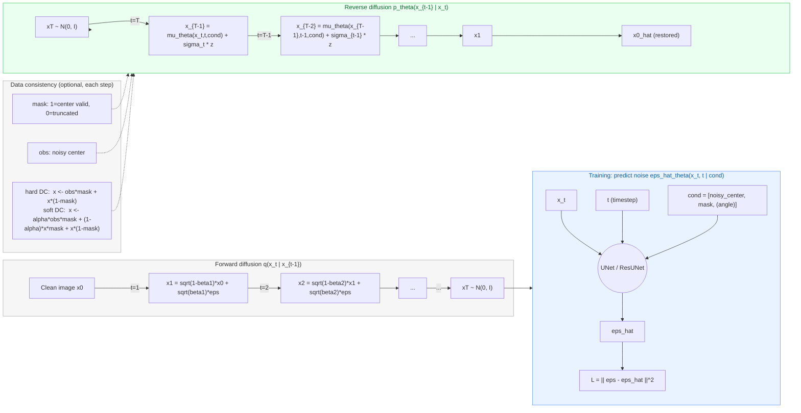

## 当前代码结构（2025-09-12）

```
CBCT_Sino_FOV/
├─ checkpoints/                  # 权重保存
│  ├─ diffusion/
│  └─ pconv_unet/               # PConv-UNet 权重
├─ configs/                      # 训练 / 采样 / 评估配置
│  ├─ train_unet.yaml
│  ├─ train_unet_pconv.yaml     # PConv-UNet 训练配置（含组合损失与续训）
│  ├─ train_diffusion.yaml
│  └─ eval.yaml                  # 统一评估配置（PSNR/SSIM、保存三联图）
├─ ctprojfix/                    # 核心库
│  ├─ data/                      # 数据集定义（Dummy / ProjectionAnglesDataset）
│  │  └─ dataset.py
│  ├─ evals/                     # 指标 (PSNR / SSIM)
│  │  └─ metrics.py
│  ├─ losses/                    # 损失 (L1/L2/SSIM/感知/风格/LPIPS/区域L1)
│  │  └─ criterion.py
│  ├─ models/
│  │  ├─ registry.py             # 模型注册器（build_model / @register）
│  │  ├─ unet.py                 # UNet baseline
│  │  ├─ unet_res.py             # ResNet-UNet 扩展
│  │  ├─ pconv_unet.py           # 新增：PConv-UNet（带单通道 mask 的 PartialConv）
│  │  └─ diffusion/              # 扩散模型 (DDPM, Sampler)
│  ├─ recon/                     # 
│  ├─ trainers/
│  │  ├─ supervised.py           # 新增：支持续训/轮转删除/组合损失的监督训练器
│  │  └─ diffusion.py
│  └─ utils/
├─ outputs/
│  └─ sample/
├─ scripts/
│  ├─ train.py                   # 统一训练入口（根据 model.name 选择 trainer）
│  ├─ evaluate.py                # 新增：统一评估（保存三联图与 metrics.csv）
│  └─ sample_diffusion.py
├─ tests/                        # 预留
├─ requirements.txt
├─ setup.py
├─ pyproject.toml
└─ README.md

```


## 当前代码结构（2025-09-07）

```
CBCT_Sino_FOV/
├─ checkpoints/ # 权重保存
│ └─ diffusion/
├─ configs/ # 训练 & 采样配置
├─ ctprojfix/ # 核心库
│ ├─ data/ # 数据集定义 (Dummy + ProjectionAnglesDataset)
│ ├─ evals/ # 指标 (PSNR/SSIM)
│ ├─ losses/ # 损失函数 (L1/L2/SSIM/频域可扩展)
│ ├─ models/
│ │ ├─ unet.py # UNet baseline
│ │ ├─ unet_res.py # ResNet-UNet 扩展版
│ │ └─ diffusion/ # 扩散模型 (DDPM, Sampler)
│ ├─ recon/ # 预留: FBP/FDK 重建
│ ├─ trainers/ # 训练循环 (SupervisedTrainer / DiffusionTrainer)
│ └─ utils/ # 工具函数 (IO, logging, mask 构造等)
├─ outputs/ # 输出目录
│ └─ sample/ # 采样可视化结果
├─ scripts/ # 可执行脚本
│ ├─ train.py # 统一训练入口
│ ├─ evaluate.py # 统一评估入口
│ └─ sample_diffusion.py # 扩散采样入口 (含 DC)
├─ tests/ # 单元测试 (预留)
├─ requirements.txt
├─ setup.py
├─ pyproject.toml
└─ README.md
```


### Diffusion 模块流程画图 LaTex风格



---


## 当前代码结构（2025‑08‑28）

> 下列模块今天已建立或已跑通（含 Dummy 空跑）：

```
CBCT_Sino_FOV/
├─ configs/
│  ├─ train_unet.yaml        # 训练配置（支持 Dummy / 真实数据）
│  └─ eval.yaml              # 评估配置（PSNR/SSIM）
├─ scripts/
│  ├─ train.py               # 统一训练入口（UTF-8 读取 cfg；模型注册触发）
│  └─ evaluate.py            # 统一评估入口（支持加载权重，Dummy 回退）
├─ ctprojfix/
│  ├─ data/
│  │  └─ dataset.py          # ProjectionAnglesDataset（遍历 360 角度）；DummyDataset
│  ├─ models/
│  │  ├─ registry.py         # 模型注册表（build_model/装饰器 register）
│  │  └─ unet.py             # UNet baseline（in_ch=2/3，out_ch=1）
│  ├─ trainers/
│  │  └─ supervised.py       # L1 损失，Adam；类型强制转换；可保存 ckpt（预留）
│  └─ evals/
│     └─ metrics.py          # PSNR & SSIM（简化版）
├─ pyproject.toml            # setuptools 可编辑安装（仅打包 ctprojfix）
└─ README.md                 # 本文件（实验思路 + 日志）
```

---

## 目标结构（规划 & 可插拔）
```
```


## 使用方法（Quick Start）

### 安装（可编辑）
```bash
pip install -e .
```

### 训练（本地无数据 → Dummy 空跑）
```bash
python scripts/train.py --cfg configs/train_unet.yaml
```
- `configs/train_unet.yaml` 中：
  - `data.use_dummy: true`（本地无数据时）
  - 若开启 `data.add_angle_channel: true`，请将 `model.params.in_ch` 设为 3

### 评估（PSNR/SSIM）
```bash
python scripts/evaluate.py --cfg configs/eval.yaml
```
- `eval.ckpt` 可填训练权重路径（为空则用随机权重，仅作流程检查）

---

## Changelog

### 2025-09-12
- **模型**
  - 新增 ctprojfix/models/pconv_unet.py：基于 Partial Convolution 的 U-Net 变体
    * 单通道 mask (B,1,H,W)，每层自动更新有效域；支持 add_angle_channel
    * 尺寸对齐策略：解码阶段先对齐到对应 skip 的空间尺寸再拼接，避免奇偶数/上取整导致的 1px 不匹配

- **损失**
  - 新增 ctprojfix/losses/criterion.py：可配置“组合损失”
    * 组件可选：L2/L1、SSIM、Perceptual(VGG16)、Style(Gram on VGG)、LPIPS、Edge(Sobel)、L1(hole/valid)
    * 依赖缺失自动降级，保证在无外网环境也能跑（仅 L2 等）

- **训练器**
  - 强化 ctprojfix/trainers/supervised.py：
    * resume_from / resume="auto" 自动续训
    * reset_epoch / reset_optim 控制是否重置计数与优化器
    * ckpt_prefix、save_every、max_keep 轮转删除旧权重
    * 对 PConv 自动取 x[:,1:2] 作为 mask 传入组合损失

- **数据**
  - ProjectionAnglesDataset：支持 mask_mode=fixed/auto_nonzero、downsample/step/truncate_left/right、角度通道

- **评估**
  - 新增 scripts/evaluate.py + configs/eval.yaml：
    * 批量计算 PSNR/SSIM
    * 保存 Noisy/Pred/GT/误差 四联图与 metrics.csv


---
### 2025-09-07
- **加入扩散模型 (Diffusion/DDPM)**：
  - 新增目录 `ctprojfix/models/diffusion/`，实现 `ddpm.py` 与 `sampler.py`
  - 新增 `ctprojfix/trainers/diffusion.py`，实现 **DiffusionTrainer**
  - 支持条件输入 `[noisy, mask, (angle)]`，可扩展 angle channel
- **训练**：
  - `configs/train_diffusion.yaml` 配置，支持 T/beta_start/beta_end 等超参
  - 服务器上实际数据集可跑通（逐角度帧，batch 维度稳定）
  - 实现 checkpoint 循环保存（max_keep 保留最近若干）
- **采样**：
  - 新增 `scripts/sample_diffusion.py`：
    - 实现 DDPM 逆扩散流程
    - 集成 **数据一致性 (DC)** 硬/软模式
    - 输出 `pred/noisy/mask/(gt)` PNG
    - 加入安全检查：
      - `assert mask.sum() > 0`（防止全零）
      - `assert mask.shape == x_t.shape`（防止尺寸错位）
  - 解决了 **downsample ≠ 1 时 mask 与中心模糊** 的 bug（mask L/R 按 downsample 缩放）
- **评估与可视化**：
  - UNet/Diffusion 均支持 `evaluate.py` 或 `sample_diffusion.py` 跑通
  - 输出样例图片，支持 Dummy 流程验证
- **训练/采样一致性**：
  - 注意 `downsample` 必须与训练配置一致，否则中心区域会被 DC 覆盖模糊
  - 已在代码中补丁，保证 mask 缩放匹配
---

### 2025‑08‑28
- 初始化仓库 & 目录骨架（configs/scripts/ctprojfix/...）
- `pyproject.toml` 完成（仅打包 ctprojfix；Python ≥3.9）
- 建立 **模型注册表 registry**；实现 **UNet baseline**
- 训练入口 `scripts/train.py`（UTF-8 读 cfg；显式触发注册）
- 实现 **SupervisedTrainer**（L1 + Adam；类型安全）
- 实现 **DummyDataset**（本地无数据可完整跑通训练）
- 新增 **PSNR/SSIM**（简化版）与 `scripts/evaluate.py`
- **ProjectionAnglesDataset**：按服务器尺寸 `(360,960,1240)` 逐角度遍历；支持 step/downsample/mask 模式
- 本地验证：Dummy 训练 2 个 epoch，loss 正常下降，评估脚本可运行

> 明日计划：加入 checkpoint 保存/加载；补充重建脚本（FBP/FDK）与指标闭环。

---

## 备注（编码/跨平台）
- Windows 下读取 YAML 建议：`open(..., encoding="utf-8")`（已在脚本中处理）服务器Linux似乎需要更改,检查一下
- 大文件/权重/图片/视频已在 `.gitignore` 中忽略，避免误传仓库
- Torch/CUDA 建议按各自平台单独安装（未写入 `pyproject.toml` 依赖）

---

## References

本项目的模型设计与数据结构主要参考以下文献：

1. **Ho, J., Jain, A., & Abbeel, P. (2020).**  
   *Denoising Diffusion Probabilistic Models*.  
   Advances in Neural Information Processing Systems (NeurIPS), 33, 6840-6851.  
    提出了 DDPM 框架，是本项目中 `ctprojfix/models/diffusion/ddpm.py` 的理论基础。

2. **Maier, A. K., Hofmann, H. G., Berger, M., Fischer, B., Schwemmer, C., Wu, H., Hornegger, J., … Kalender, W. A. (2013).**  
   *CONRAD — A software framework for cone-beam imaging in radiology*.  
   Medical Physics, 40(11), 111914.  
    提供了 CBCT 投影与重建的系统框架，尤其涉及截断/噪声建模与 FOV 扩展，是本项目中  
   `ctprojfix/data/dataset.py`（ProjectionAnglesDataset 与截断 mask 设计）的参考依据。

---
